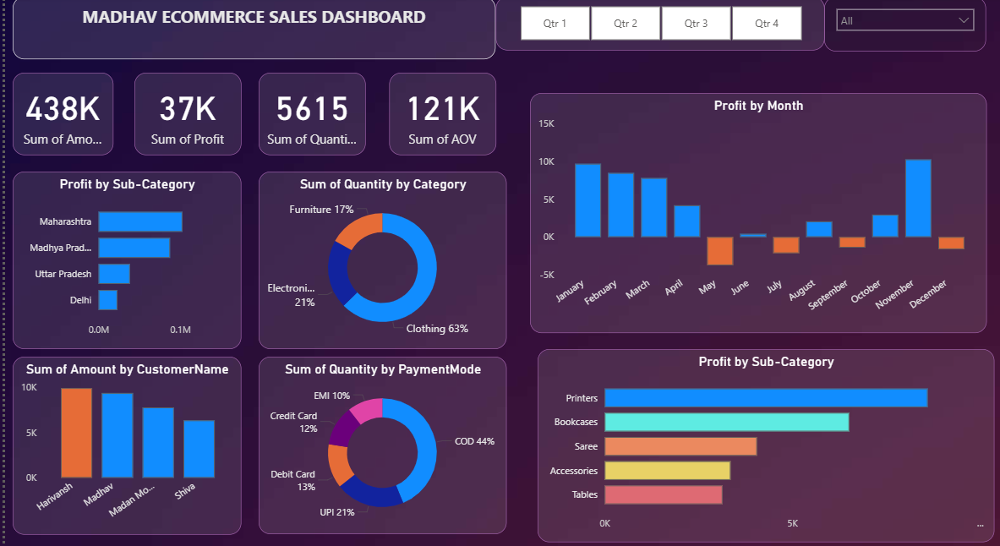

# 📊 Online Sales Dashboard – Power BI

## 📝 Project Description
An interactive Power BI dashboard designed to track and analyze online sales data. This dashboard allows users to filter by various categories, explore trends, and gain insights into product and regional performance.

---

## 💡 Key Features
- KPI cards showing total sales, profit, quantity, and more
- Dynamic filters and slicers for category, sub-category, and region
- Visualizations for monthly trends, category share, and product performance
- Drill-down functionality for deeper insights

---

## 🛠 Tools Used
- Power BI (Data Modeling, DAX, Visualizations)
- Excel (Sales Dataset)
- DAX Calculations & Parameters

---

## 🎯 Project Learnings
- Created an interactive dashboard to track and analyze online sales data
- Used complex parameters to enable drill-down in worksheets  
- Customized visualizations using filters and slicers for a personalized user experience
- Built relationships, joined multiple tables, and performed calculations to manipulate data effectively
- Enabled user-driven parameters for dynamic and custom visualizations
- Implemented a variety of chart types:  
  ➤ Bar chart, Pie chart, Donut chart  
  ➤ Clustered bar chart, Scatter chart, Line chart  
  ➤ Area chart, Map, and interactive Slicers

---

## 📁 Files Included
- SALES DASHBOARD.pbix

  

---

## 📷 Preview 

---

## 📌 Insights Gained
This project enhanced my skills in:
- Data modeling and relationship building
- Creating professional BI reports with storytelling elements
- Using DAX for business logic and calculated measures
